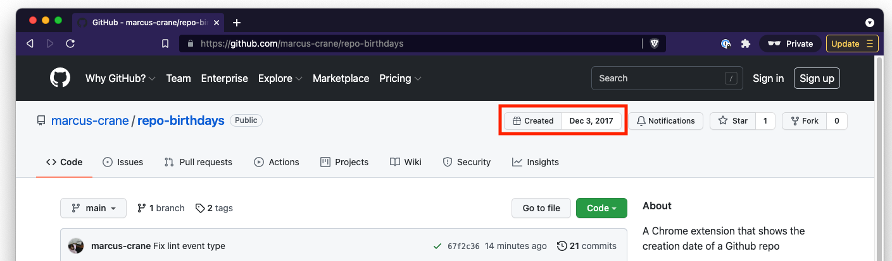
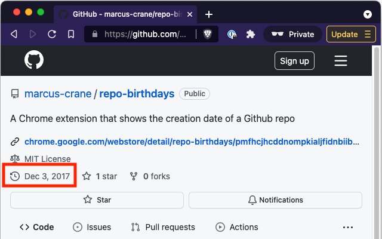

# Repo Birthdays

This is a Chrome extension that shows when a Github repo was first created.

No longer published on the Chrome Web Store, as I don't have a Google account. You can still install it manually though.

## Screenshots

